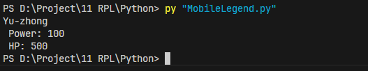
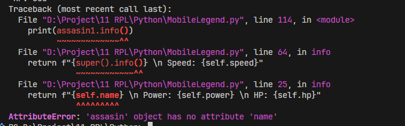
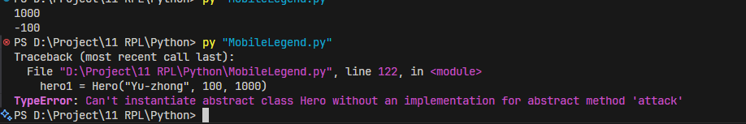
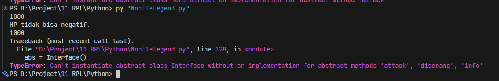

Berikut versi **README.md** yang lebih natural, santai, dan enak dibaca manusia (siap copy–paste ke GitHub 👇).

---

# 📘 OOP Python Practice

## Jawaban Tugas Analisis 1–5

Modul: Koding & Kecerdasan Artificial
Kelas XI – RPL

Repository ini berisi hasil analisis dan percobaan praktik tentang **Pemrograman Berorientasi Objek (OOP)** menggunakan Python.
Semua jawaban disusun berdasarkan eksperimen langsung saat coding.

---

# 🧠 Tugas Analisis 1

## Mengubah Attribute Secara Langsung

### 🔎 Percobaan

```python
hero1 = Hero("Layla", 100, 15)
hero1.hp = 500
print(hero1.hp)
```

### 📷 Hasil



### ✍ Penjelasan

HP berhasil berubah menjadi **500**.

Kenapa bisa?
Karena `hp` masih bersifat **public**, jadi bisa diubah langsung dari luar class.

👉 Artinya: kalau belum menggunakan encapsulation, data bisa diubah bebas (bahkan bisa disalahgunakan).

---

# 🧠 Tugas Analisis 2

## Kenapa Parameter `lawan` Harus Objek?

### 🔎 Method yang Digunakan

```python
def serang(self, lawan):
    print(f"{self.name} menyerang {lawan.name}!")
    lawan.diserang(self.attack_power)
```

### ✍ Penjelasan

Parameter `lawan` harus berupa **objek**, bukan string.

Kalau hanya string seperti `"Zilong"`:

* Kita tidak bisa mengakses `lawan.name`
* Tidak bisa memanggil `lawan.diserang()`
* HP tidak bisa dikurangi

---

# 🧠 Tugas Analisis 3

## Apa Jadinya Kalau `super()` Dihapus?

### 🔎 Percobaan

```python
class assasin(Hero):
    def __init__(self, name, hp, attack_power, speed):
        # super().__init__(name, hp, attack_power)
        self.mana = mana
```

### 📷 Error yang Muncul



### ❌ Error

```
AttributeError: 'assasin' object has no attribute 'name'
```

### ✍ Penjelasan

Error muncul karena constructor milik parent (`Hero`) tidak dijalankan.

Akibatnya:

* `name` tidak dibuat
* `hp` tidak dibuat
* `attack_power` tidak dibuat

Padahal atribut tersebut ada di class Hero.

### 🔑 Fungsi `super()`

`super()` digunakan untuk:

* Memanggil constructor parent
* Menghubungkan class anak dengan class induk
* Menghindari pengulangan kode

Tanpa `super()`, pewarisan tidak berjalan sempurna.

---

# 🧠 Tugas Analisis 4

## Encapsulation & Name Mangling

### 🔎 Percobaan Akses Paksa

```python
print(hero1._Hero__hp)
```

### 📷 Hasil


### ✍ Penjelasan

Nilai HP tetap muncul.

Kenapa?
Karena Python menggunakan **Name Mangling**.
`__hp` sebenarnya diubah menjadi `_Hero__hp`.

Walaupun bisa diakses, ini **tidak disarankan** dalam praktik pemrograman yang baik.

---

### 🔎 Jika Setter Dihapus Validasinya

```python
hero1.set_hp(-100)
```

### 📷 Hasil


### ✍ Penjelasan

HP menjadi negatif.

Inilah alasan kenapa setter penting:

* Mencegah nilai tidak valid
* Menjaga integritas data
* Mencegah cheat atau bug

Setter berfungsi sebagai “penjaga pintu” data.

---

# 🧠 Tugas Analisis 5

## Abstraction & Kontrak Interface

### 🔎 Jika Method `serang()` Dihapus

### 📷 Error



### ❌ Error

```
TypeError: Can't instantiate abstract class Hero with abstract method serang
```

### ✍ Penjelasan

Error ini berarti:
Class Hero belum memenuhi kontrak dari abstract class.

Kalau kita janji punya method `serang()`, maka method itu **wajib dibuat**.

---

### 🔎 Jika Abstract Class Dibuat Objek

```python
unit = GameUnit()
```

### 📷 Error



### ✍ Penjelasan

Abstract class hanya blueprint.
Tidak boleh dibuat objek langsung.

Fungsinya hanya sebagai:

* Standar
* Aturan
* Kontrak bagi class turunannya

---

# 🎯 Kesimpulan Akhir

Dari praktik ini saya memahami bahwa:

* **Class** adalah cetakan
* **Object** adalah hasil cetakan
* **Inheritance** mempermudah pewarisan fitur
* **Encapsulation** menjaga keamanan data
* **Polymorphism** membuat kode fleksibel
* **Abstraction** membuat sistem lebih terstruktur

